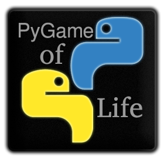

PyGame of Life 
===========

<p align="center">
  
</p>

##Build status
Last build in Travis continuous integration  
[](https://travis-ci.org/rubenspgcavalcante/pygameoflife)

##About

This game is based in the 'Game of Life' or simply 'Life' proposed by John Conway in a scientific [article](http://ddi.cs.uni-potsdam.de/HyFISCH/Produzieren/lis_projekt/proj_gamelife/ConwayScientificAmerican.htm) in 1970.  
It's a celular automaton wich follows a few rules

#Download
To execute just run the "run-pygameoflife" executable.  
The current releases are:
*    Version 0.82:
    *    [Windows i686](http://sourceforge.net/projects/pygame-of-life/files/pygameoflife_0.82_Win_i686.zip/download)
    *    [Linux x86-64](http://sourceforge.net/projects/pygame-of-life/files/pygameoflife_0.82_Linux_x86_64.zip/download)

###The Rules

*    For a space that is 'populated':
    *    Each cell with one or no neighbors dies, as if by loneliness. 
    *    Each cell with four or more neighbors dies, as if by overpopulation. 
    *    Each cell with two or three neighbors survives.  
  
  
*    For a space that is 'empty' or 'unpopulated'
    *   Each cell with three neighbors becomes populated. 

***

#Running
To run directly just install the dependeces, generates the resources and execute by:
```
make setup
make resources
python __main__.py
```

##Dependeces
Tested in Ubuntu 12.10 LTS 64 wich the following versions
*    python >= 2.6.x
*    pygame >= 1.9.x
*    pyqt >= 4.x
*    pyuic4 >= 4.9.x
*    pyrcc4 >= 4.8.x
*    PIL >= 1.1.x
*    zip >= 3.x
*    unzip >= 5.51.x
*    cx-Freeze >= 4.3.x

##Building Installing
If you want to build or/and install, do:  
The first command will download and install all dependeces, if you didn't already installed. (Needs apt)  
Then, will build and compile the code using cx-Freeze. The build will be stored in release directory with the name pygame-of-life_OS_ARCH.zip where OS is your Operational system and ARCH your processor (or hardware) architeture. (If you just want build stops in this pass)  
The last command will: (Note, it will work only in Unix based system)  
Install under /usr/share/ the last release  
Create a symbolic link into /usr/games  
Create a desktop entry into /usr/applications
```
sudo make setup
make
sudo make install
```

to unistall, just run
```
sudo make unistall
```

##Author

Rubens Pinheiro Gonçalves Cavalcante  
email: [rubenspgcavalcante@gmail.com](mailto:rubenspgcavalcante@gmail.com)

##License & Rights

Using GNU LESSER GENERAL PUBLIC LICENSE *Version 3, 29 June 2007*  
[gnu.org](http://www.gnu.org/copyleft/gpl.html,"GPLv3")  
